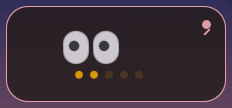
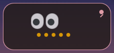
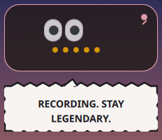

# PetBot — meet Bloop, a sound-reactive desktop bot for Caelestia

Bloop is a tiny WALL-E-meets-LCARS bot that floats above your windows on a Caelestia
desktop. Two binocular eyes blink, tilt, squash and dilate with whatever is playing;
below them, a row of Star Trek-amber dots is its mouth — and its VU meter, rippling
with the sound. Every now and then it says something nice, in a comic-book action
balloon, aligned with the time of day.

It started life as a performance hack: a sound meter built to replace Caelestia's
full-screen background visualiser, which was eating CPU on a small iGPU laptop. The
meter worked so well that it grew a face. The cheapness stayed: Bloop is plain
rectangles and text driven by a 20 Hz snapshot of the shell's audio analyser — no
blur, no shaders, no image assets.

| At rest | Reacting to your sound | Saying something |
|---|---|---|
|  |  |  |

[Watch the 14-second demo video](docs/demo.mp4) — Bloop greets a screen recording,
then reacts to sound.

## What Bloop does

- **Reacts to your sound.** The binocular eyes tilt, squash and dilate, the amber
  dot row ripples like a VU meter, and the whole bot hops on beats. It samples the
  shell's own cava analyser at 20 Hz — nothing extra runs on your machine.
- **Talks, occasionally.** A mood-lifting one-liner every 20–45 minutes (and a greeting
  shortly after the shell starts), bucketed by time of day: morning, midday,
  afternoon, evening, and gentle late-night nagging to go to bed. Each message pops a
  Marvel-style action balloon — jagged burst, bold uppercase — with a soft spatial
  stereo bloom sound, and while it shows, Bloop lifts itself above your windows even
  when unpinned, settling back afterwards.
- **Reacts to screen recording.** The moment a recording starts, Bloop clears its
  throat: "ACTION! YOU'RE THE STAR OF THIS TAKE." (or one of its friends).
- **Floats by default.** Bloop lives above your windows out of the box. A small pin
  button in the plate's corner (two-note sci-fi ping) parks it back into the desktop
  corner, pinned in; pinned in, the whole plate becomes a drag surface and you can
  park Bloop anywhere on screen. Pin state and position survive shell restarts.
- **Cheap.** A fraction of one core while audio plays on a 144 Hz display — the same
  ballpark as the original sound meter it grew out of, and far cheaper than the
  visualiser it replaces.

## Requirements

- [Caelestia Shell](https://github.com/ladybug-me/caelestia-kde) (KDE Plasma 6 port,
  built on Quickshell). Bloop installs as a native Caelestia **user plugin** — no
  shell patching, it is discovered automatically on every shell start.
- Quickshell 0.3.x (what current Caelestia releases pin).

## Install

```bash
git clone https://github.com/ciberjohn/caelestia-petbot.git
cd caelestia-petbot
./install.sh
systemctl --user restart caelestia-shell.service
```

Bloop appears floating above your windows in the top-right corner of your primary
screen and greets you about 30 seconds later. To remove it: delete `~/.config/caelestia/plugins/petbot` and
restart the shell. To disable without deleting: Nexus → Settings → Plugins.

## Customize

Everything interesting is at the top of `plugins/petbot/main.qml`:

- `screenName` — pin Bloop to a specific output (empty = primary screen)
- `plateWidth`, `plateHeight`, `edgeMargin` — plate size and corner offset
- `bubbleShowSecs` — how long balloons stay up
- the message lists in `currentMessages()` — your own one-liners, bucketed by hour
- the bot's colors — the eyes are plain `Rectangle`s and the LCARS amber is a single
  `color` constant near the top of the face; the plate and accents follow your
  Material You wallpaper colors

The sounds are synthesized, not recorded — `plugins/petbot/make-pings.py` regenerates
all four (pin on/off, message bloom left/right) from scratch, so you can change the
notes, decay and reverb to taste and re-run the script.

## How it works (the mildly technical bit)

- Bloop is a Wayland layer-shell surface (`PanelWindow` on `WlrLayer.Bottom`, with
  the wallpaper; `Top` when pinned-in or while speaking), so it coexists with normal
  windows without taskbar entries or focus stealing.
- Quickshell 0.3.x does not position unanchored layer surfaces (the compositor
  centers them), so the surface is always anchored to the top-left edge and the
  position is expressed entirely through layer margins — any screen position is
  reachable that way, and pin/float/drag modes differ only in margins, size and
  layer.
- Dragging a small window client-side stalls once the cursor outruns the input
  region, so while the button is held the window silently expands to a transparent
  full-screen surface — the cursor can never leave it, positioning becomes absolute,
  and it shrinks back on release. No click-through cost at rest.
- Mood messages are picked from hour-appropriate buckets with no immediate repeats;
  the balloon itself is a `Canvas` painted once per message, not per frame.

## License

MIT — see [LICENSE](LICENSE). The Caelestia name belongs to the
[Caelestia](https://github.com/ladybug-me/caelestia-kde) project; this is an
independent user plugin for it.
